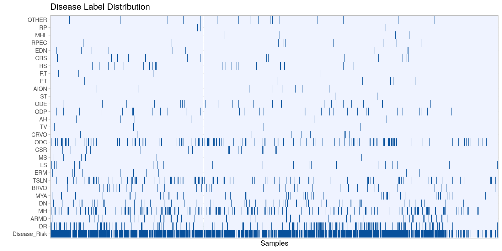
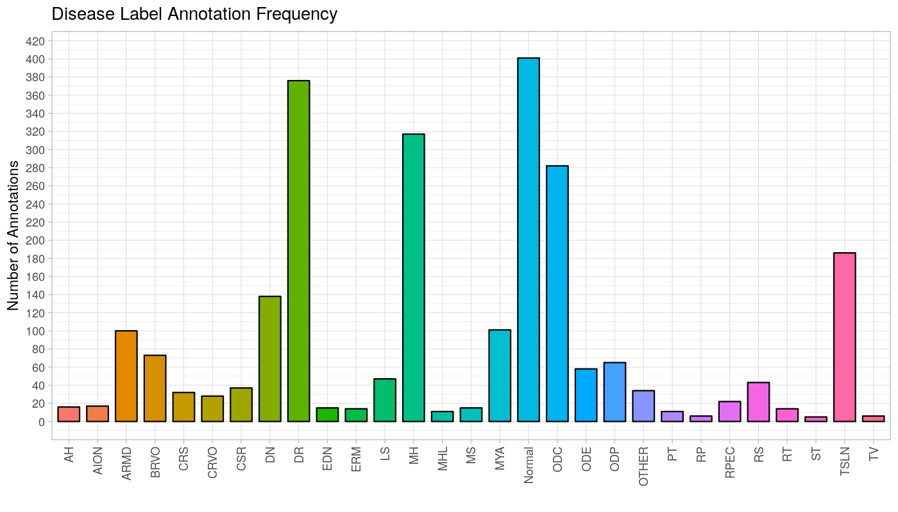

# MULTI-DISEASE DETECTION IN RETINAL IMAGING BASED ON ENSEMBLING HETEROGENEOUS DEEP LEARNING MODELS

Participation at the Retinal Image Analysis for multi-Disease Detection Challenge

todo

**This work does NOT claim clinical performance in any means and underlie purely educational purposes.**

## Reproducibility

**Requirements:**
- Ubuntu 18.04
- Python 3.6
- NVIDIA TITAN RTX or a GPU with equivalent performance

**Step-by-Step workflow:**  
todo

## Dataset: RIADD

**Reference:** https://riadd.grand-challenge.org/Home/

The fundus images in RFMiD were captured by a retinal specialist himself at an Eye Clinic and public screening camp organized at the Center of Excellence in Signal and Image Processing, SGGS Institute of Engineering and Technology both located in Nanded, (M.S.), India.  From the thousands of examinations available, we have extracted 3200 images to form our dataset.

This dataset consists of diseases/abnormalities (diabetic retinopathy (DR), age-related macular degeneration (ARMD), media haze (MZ), drusen (DN), myopia (MYA), branch retinal vein occlusion (BRVO), tessellation (TSLN), epiretinal membrane (ERM), laser scar (LS), macular scar (MS), central serous retinopathy (CSR), optic disc cupping (ODC), central retinal vein occlusion (CRVO), tortuous vessels (TV), asteroid hyalosis (AH), optic disc pallor (ODP), optic disc edema (ODE), shunt (ST), anterior ischemic optic neuropathy (AION), parafoveal telangiectasia (PT), retinal traction (RT), retinitis (RS), chorioretinitis (CRS), exudation (EDN), retinal pigment epithelium changes (RPEC), macular hole (MHL), retinitis pigmentosa (RP), cotton wool spots (CWS), coloboma (CB), optic disc pit maculopathy (ODPM), preretinal hemorrhage (PRH), myelinated nerve fibers (MNF), hemorrhagic retinopathy (HR), central retinal artery occlusion (CRAO), tilted disc (TD), cystoid macular edema (CME), post traumatic choroidal rupture (PTCR), choroidal folds (CF), vitreous hemorrhage (VH), macroaneurysm (MCA), vasculitis (VS), branch retinal artery occlusion (BRAO), plaque (PLQ), hemorrhagic pigment epithelial detachment (HPED) and collateral (CL)) based on their visual characteristics as shown in the Figure below.





Microscope distribution:  
{(1424, 2144, 3): 1493, (1536, 2048, 3): 150, (2848, 4288, 3): 277}

## Methods

todo

## Results & Discussion

todo

## Author

Dominik Müller  
Email: dominik.mueller@informatik.uni-augsburg.de  
IT-Infrastructure for Translational Medical Research  
University Augsburg  
Bavaria, Germany

## How to cite / More information

Coming soon.

```
Coming soon.
```

Thank you for citing our work.

## License

This project is licensed under the GNU GENERAL PUBLIC LICENSE Version 3.  
See the LICENSE.md file for license rights and limitations.
